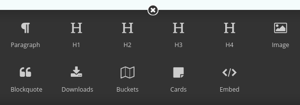

Wagtail FontAwesome
====================
Add [FontAwesome](https://github.com/FortAwesome/Font-Awesome) icons to StreamField.



Install
-------

```shell
pip install wagtailfontawesome
```

Then add `wagtailfontawesome` to your installed apps.

Usage
-----
### StreamField
Add FontAwesome icons to StreamField [the regular way](http://docs.wagtail.io/en/latest/topics/streamfield.html#basic-block-types), just set `icon="fa-something"`. Reference [the full list](http://fontawesome.io/icons/).

### wagtailmodeladmin
[wagtailmodeladmin](https://github.com/rkhleics/wagtailmodeladmin) is supported if you're using Wagtail 1.4 or above. Similar to StreamField, just set `icon="fa-something"` on your menu item.

### Hallo plugins
You can use FontAwesome icons on custom Hallo buttons by setting the `icon` option to `icon icon-fa-something`.

```javascript
button.hallobutton({
  label: "Blockquote",
  icon: 'icon icon-fa-quote-left',
});
```

### Other parts of the admin
You can include icons anywhere in the admin with:

```html
<i class="icon icon-fa-something"></i>
```

In Wagtail 1.3.x and below you can only use icons on the page editor screen.

### On the front-end
You can also import this on the front-end, if you want.

```html


<link rel="stylesheet" href="">
```

Then include icons anywhere on the front-end with:

```html
<i class="icon icon-fa-something"></i>
```

### Using wagtailfontawesome as an optional dependency
If you want to distribute a Wagtail plugin with FontAwesome icons, you can use this package as an optional dependency by checking if it's installed in Django, and falling back otherwise.

```python
from django.apps import apps
from wagtail.wagtailcore.blocks import StructBlock


class BlockquoteBlock(StructBlock):
    quote = TextBlock()
    author = TextBlock()

    class Meta:
        if apps.is_installed('wagtailfontawesome'):
            icon = 'fa-quote-left'
```

(in this case, the fallback is to do nothing)
